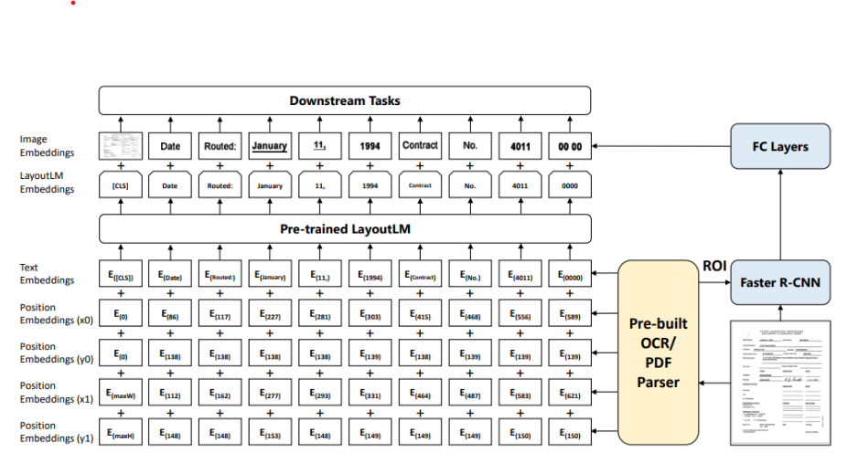
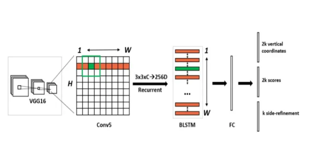

# Comparison of end2end and non-end2end multimodal systems for Document understanding tasks

**Team Members**

- Gowtham Ramesh (gramesh4[at]wisc.edu)
- Sai Nikhilesh (krishnamurt6[at]wisc.edu)

**Important Links**:
* [Project Presentation](https://docs.google.com/presentation/d/1BBncP_47NYVJuRKSjDor3BBBGDCyg22n_Jp5UM1fvIE/edit#slide=id.p)
* [Project Video]()
* [Code Repository]()

1. TOC
{:toc}

<html>
<head>
  <meta charset="utf-8">
  <meta name="viewport" content="width=device-width">
  <title>MathJax example</title>
  
  
</head>
<body>

# Introduction

The field of multi-modal deep learning is rapidly developing, with
the goal of creating models that can process and understand data from multiple
sources like text, images, and audio. The integration of different modalities,
such as text, images, and audio, is becoming increasingly important in areas
such as natural language processing, computer vision, and robotics. In this
project, we aim to compare the embeddings of end-to-end multi-modal systems,
which incorporate both CNN and transformer networks [9] trained together,
with non-end-to-end systems that process individual modalities for tasks 
involving text-rich images such as receipts/visiting cards and PDF documents.

# Problem Statement

In this project, we plan to compare the end2end and non-end2end multimodel 
systems for Document understanding tasks where the primary focus lies on
1. what is the qualitative and quantitative quality of the embeddings 
generated by end to end multimodel systems as compared to non-end-to-end 
approaches
2. How do the two approaches compare in terms of the amount of text present in 
the images, considering low-text content scenarios such as visiting cards and 
high-text content scenarios like documents?
3. How do the two approaches perform in scenarios with limited data resources, 
such as low-resource settings, compared to high-resource settings
for fine-tuning?

By answering the questions posed in this project, we can better understand the 
effectiveness and efficiency of end-to-end approaches compared to non-end-to-end 
approaches for processing such datasets. Additionally, it is an interesting research 
question to explore the benefits of end-to-end approaches, as they are generally more 
challenging to train than non-end-to-endcounterparts. Overall, this project has 
practical implications for industry and academic researchers in developing better 
multi-modal deep learning models for text-rich datasets.

# Datasets and Evaluation

Stanford Visual search dataset[2]: Though this dataset was created for visual
image search. Some of the subsets, like book covers, business cards, and DVD
covers, have images that have text. We plan to use the business cards dataset so
that we can also test the models on entity extraction + detection. In addition
to the Stanford visual dataset, we will also augment this collection with blp
business cards dataset1
. In total, we have 480 images with each image containing
up to 8 fields - name, phone, address, fax, website, email, designation and
company.
FUNSD[4]: The FUNSD dataset is a collection of annotated forms in various
formats, including scanned PDFs and images, designed for form understanding
tasks such as layout analysis, information extraction, and field identification.
The dataset contains 199 real, fully annotated, scanned forms, as shown in
Figure 1.
RVL-CDIP dataset[7]: Unlike the other three datasets, which focus on entity
extraction, this dataset contains images of emails, documents, invoices, scientific
text, etc, and we intend to use this for document classification. Specifically, It
consists of 400,000 grayscale images in 16 classes, with 25,000 images per class.
There are 320,000 training images, 40,000 validation images, and 40,000 test
images.
In summary, we plan to use 3 datasets - one with less text, one with denser
text for entity recognition and a dataset for document classification/ clustering.

<!-- 

## Primer on Brain injuries and potential features that model would use for classification: -->

<!-- * **Acute infarct**: An acute infarct, also known as a stroke, is a type of brain injury that occurs when blood flow to a specific area of the brain is disrupted, causing brain tissue to die. The model might look for evidence of this in the brain scan, such as areas of decreased blood flow or areas of dead brain tissue.
* **Arteriovenous anomaly**: An arteriovenous anomaly is a type of brain injury in which there is a abnormal connection between the arteries and veins in the brain.
* **Chronic infarct**: Chronic infarcts are brain injuries that occur over a longer period of time, as opposed to acute infarcts which occur suddenly. Chronic infarcts are caused by a disruption in blood flow to the brain, resulting in brain tissue death. These changes are typically visible on brain scans as darker contours clearly constrating against the normal brain's grey color and the model can be trained to recognize them.
* **Edema**: Edema, or swelling, in the brain can be a sign of a brain injury. It occurs when excess fluid builds up in the brain, causing the tissue to become swollen. This can lead to additional damage to the brain.
* **Extra**: Extra is a term used to describe anything that is outside of the normal range or expectation. In the context of brain injuries, it may refer to abnormalities or conditions that are not typical or expected.
* **Focal flair hyper**: Focal flair hyper refers to a specific type of brain injury in which there is an increase in blood flow to a particular area of the brain. This increase in blood flow can be a sign of injury or damage to the brain tissue. This can typically be seen on brain scans as an area of increased brightness or contrast.
* **Intra**: Intra is a term that means "within" or "inside." In the context of brain injuries, it may refer to injuries or conditions that affect the brain tissue directly, rather than affecting the blood vessels or other structures outside of the brain.
* **Normal**: Normal in this context refers to the absence of brain injuries or abnormalities. A "normal" brain scan would show no evidence of injuries or other conditions.
* **Pituatary lesion**: A pituitary lesion is a type of brain injury that affects the pituitary gland, which is a small gland located at the base of the brain. Pituitary lesions can interfere with the gland's ability to produce hormones, which can lead to a wide range of health problems. The model would try to look for abnormalities around the pituitary gland.
* **White matter changes**: White matter changes refer to changes in the white matter of the brain, which is made up of nerve fibers that carry signals between different areas of the brain. The model can be trained to look for changes in the size, shape, or density of the nerve fibers that make up the white matter. -->

# Models

### End2EndModel - LayoutLM (Deep Learning Model)

LayoutLM is a multimodal Transformer model which is used to
perform document processing. 
It is a pre-training model that incorporates both text and layout
information for document image understanding. The authors demonstrate that
LayoutLM achieves state-of-the-art performance on several image- text downstream 
tasks by jointly pre-training on text and layout tasks. LayoutLM is built
on top of the widely used BERT architecture and extends it to incorporate 
layout information by adding an additional layout embedding layer.
We plan to use LayoutLM as our end to end model for this project.

### Non End2EndModel - CTPN

CTPN refers to Connectionist Text Proposal Network. This name was given to this model 
because it detects text lines in sequence of text proposals. 
It uses a pre-trained VGG16 model to extract features from the image 
and then uses a recurrent neural network to generate text proposals. 
The proposals are then scored and refined; the final text boxes are output.
The CTPN has several advantages over previous methods for detecting text in natural images. 
First, it is able to detect text in a wider range of conditions, including low-light and cluttered images. 
Second, it is able to detect text of different sizes and fonts. Third, it is able to detect text in multiple languages.
We will use CTPN as the visual model for the non-end-to-end variant to
extract text proposals. These text proposals would then be fed to OCR systems
for text and LSTM/transformer-based networks for entity recognition. All these
systems would be optimized separately.

### BERT (Natural Language Processing Model)

BERT refers to Bidirectional Encoder Representations from Transformers. 
This is a language representation model that can be used for a wide range of natural language
processing tasks. It is pre-trained on a massive dataset of unlabeled text with
the masked language model objective, and can be fine-tuned with just one additional output layer 
to create state-of-the-art models for a wide range of tasks.
We plan to adapt BERT or a variant of BERT to do entity recognition on
top of OCRed output.

<!-- The ViT[[1]](#1) model uses a Transformer-like architecture to classify images.
An image is split into fixed-size patches, each patch is embedded,
position embeddings are added, and the resulting sequence of vectors is
fed to a standard Transformer encoder. The standard approach of adding
an extra learnable classification token to the sequence is used to
perform classification.

The self-attention mechanism in the transformer is used to calculate a
weighted sum of the input vectors, where the weight for each vector is
based on the dot product of the query vector with the key vector for
that vector.

This can be written mathematically as:

 $$\mathrm{Attention}(Q, K, V) = \mathrm{softmax}\left(\frac{QK^T}{\sqrt{d_k}}\right)V$$ 

where \(Q\) is the query matrix, \(K\) is the key matrix, \(V\) is the value
matrix, and \(d_k\) is the dimension of the keys. -->

### Complexity for Efficient Attention mechanisms

A image of size \(H X W X M\) is first divided into smaller tokens of size \(P\) X \(P\) X \(M\) where \(P\) is the patch size and \(M\) is the number of channels. The total number of tokens is \(N = H * W / P^2\).

These image patches are then projected to a dimension of \(C\) using a linear projection. The complexity of each attention mechanism is given below:

| Model                   | Architecture Complexity |
| ----------------------- | ----------------------- |
| Transformer (SA)        | O($$N^2C$$)             |
| Linformer (LA)          | O($$N^2C$$)             |
| Performer (PA)          | O($$NC^2$$)             |
| Fastformer (AA)         | O($$NC$$)               |
| XCiT (XCA)              | O($$NC^2$$)             |
| Swin Transformer (Swin) | O($$NC^3$$)             |

## Model Architecture - Transformer Backbone

In order to perform a fair comparison across the different attention mechanisms, we use a common transformer backbone architecture for all our experiments.

* We first divide the input images into a fixed number of patches (for all results here, we use the patch size as 7)
* We then obtain the patch embeddings that are fed as input to a sequence of modules. Each module includes a **Transformer block** and a **Patch Merge** operation.
* The Patch Merge operation combines every 2 x 2 patch into a single one as the depth of the model increases. This has the effect of reducing the sequence length (number of patches).
* In the final module, instead of a Patch Merge operation, we have a **Patch Pooling** operation. This effectively averages the representation over all patches giving us a single feature vector for the image that is then fed as input to the linear **Classifier** layer.
* The model is optimized using the Cross-Entropy loss.
* For each of our experiments, the overall structure of the model remains fixed and only the **type of attention** used in the Transformer layers is modified.

# Results

## Top-1 Accuracy

For all of the models we have included as part of this report, we adjust
the model configuration (number of layers, feed-forward units, etc.) to
approximately 28M parameters. This allows us to conduct a fair
comparison of the models by changing the attention mechanisms while
keeping all other factors the same.

The general trends we observe from the accuracy scores are

  * Transformer models outperform the CNN baseline.
  * Efficient attention models perform as well as or sometimes even better than the full self-attention model.
  * Fastformer is our best performing model with a top-1 accuracy of 91%.

## Benchmarking the FLOPS and Inference Latency

| Model Config       	| Intel Xeon(s) 	| Nvidia RTX 2060 Ti(s) 	| Nvidia A100(s) 	| FLOPS (Giga)    	| Parameters (M) 	|
|--------------------	|------------	|--------------------	|------------	|---------------	|----------------	|
| Linformer          	|     7.13    	|         0.18        	|    0.09    	|     1.56      	| 28.56       	|
| Performer          	|     6.249    	|         0.16         	|    0.07    	|     1.47      	| 28.28       	|
| Swin transformer   	|     6.86   	|         0.18        	|    0.086   	|     1.50      	| 28.28       	|
| Resnet50           	|     8.63    	|         0.2         	|    0.12     	|     4.00      	| 25.6        	|
| Vision Transformer 	|     8.904    	|         0.26        	|    0.13    	|     1.91      	| 28.27       	|
| Fastformer         	|     4.589    	|         0.14         	|    0.05     	|     1.45      	| 28.28       	|
| XCIT               	|     6.452    	|         0.17         	|    0.07     	|     1.47      	| 28.28       	|

**NOTE** : Higher FLOPs != slower inference

* FLOPs is hardware agnostic, while inference time depends on the device we deploy the model on.
* Different devices have optimizations and parallelizations for various architectures, hence inference latency and FLOPs are not necessarily correlated.

### FLOPs vs Accuracy

* Resnet-50 is not shown in the above plot since it distorts the scale. It uses 4 GFLOPs worth of computation.
* Efficient Transformer models, on average, utilize ~35% fewer FLOPs than the full self-attention model.
* Fastformer, our best performing model, also uses the least FLOPs - best of both worlds.

### Inference Latencies on CPU

* We use the 2nd generation Intel Xeon Platinum 8000 series processor with all cores to compute the latency.
* We use a batch size of 1 and average the latency over the entire test set.
* Even though Resnet-50 uses 2.5x more FLOPs than the full self-attention transformer model, it has a lower latency time. This is because the convolution operation has been parallelized and optimized heavily for inference.

### Inference Latencies on GPU

* We consider two classes of GPUs for inference - the RTX 2080Ti and the latest model A100.
* While running on the GPUs, instead of a cold start, we run a few batches for warm up and then measure inference latency. A cold start can lead to unreliable inference numbers.
* An interesting trend to observe here is that on newer GPUs that are optimized for transformers (green curve for A100) we observe a drastic reduction in the relative difference between inference time of full self attention Transformer model and the Resnet-50.

## Integrated Gradients and Saliency Maps

We use saliency maps to help us identify which locations in the image are important for the classification decision. Saliency maps utilize the magnitude of gradients to determine points in the image that play a crucial role in making the prediction. Higher the gradient magnitude at a particular point, the more important that location is for the image classification decision.

* The first column is the input image, the second column is the magnitude of gradients and the third column superimposes the saliency map onto the original image.
* The saliency maps in the above image are from the Fastformer model - we did not notice any major differences between the various transformer models.
* This is promising - Approximation of the attention mechanism does not affect the interpretability of the model!

 

</body>
</html>

# Gradio Demo

Please use the above image from our test set to try out the demo. You can find more images from our test set [here](https://github.com/gowtham1997/CS639-website/tree/main/gradio_sample_images)

<iframe src="https://f5db3d010e2e6201.gradio.app" width="1200" height="900"></iframe>

If the above demo is not working as expected, please feel free to email us at {msreedhar/gramesh4}[at]wisc.edu

## References
<a id="1">[1]</a> [Pre-training of deep bidirectional transformers for language understanding] by  
<a id="2">[2]</a> [Towards Robust Vision Transformer] 
